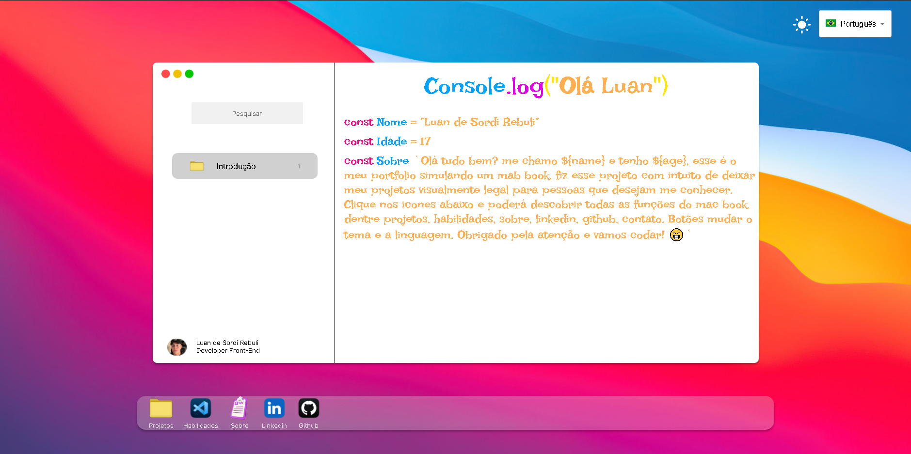

<h1 align="center">Luan Portfolio</h1>

<h3 align="center">
 Me conheça!
</h3>

## 🏠 About the project

Criei esse meu portfólio pessoal inspirado no design do MacBook. Utilizando React JS e Styled Components, cada seção funciona como um aplicativo independente, proporcionando uma experiência inovadora para o usuário. Com a opção de escolher entre temas claro e escuro e usei o i18 para possibilidade de alternar entre português e inglês. Este projeto me permitiu explorar minha criatividade e foi realizador fazer esse codigo e muito divertido, o principal eu diria.
 

## 🖥️ Technologies

[React.Js]  
[Styled-Compoents]  
[Vite]  
[i18n]  

## 🖥️ Future updates

[❌ Sistema de Contato]  
[❌ Menu de Configuração(Editar Background, etc]  
[❌ Atualização na abas de Sobre e Habilidades]  

## Run Project in you Navigator

https://luan-portfolio-tau.vercel.app

## Contributors

We thank the following people who contributed to this project:

<table>
  <tr>
    <td align="center">
      <a href="#">
         
        
          <b>Luan Rebuli</b>
        
      </a>
    </td>
  </tr>

## Certificates

</table>
